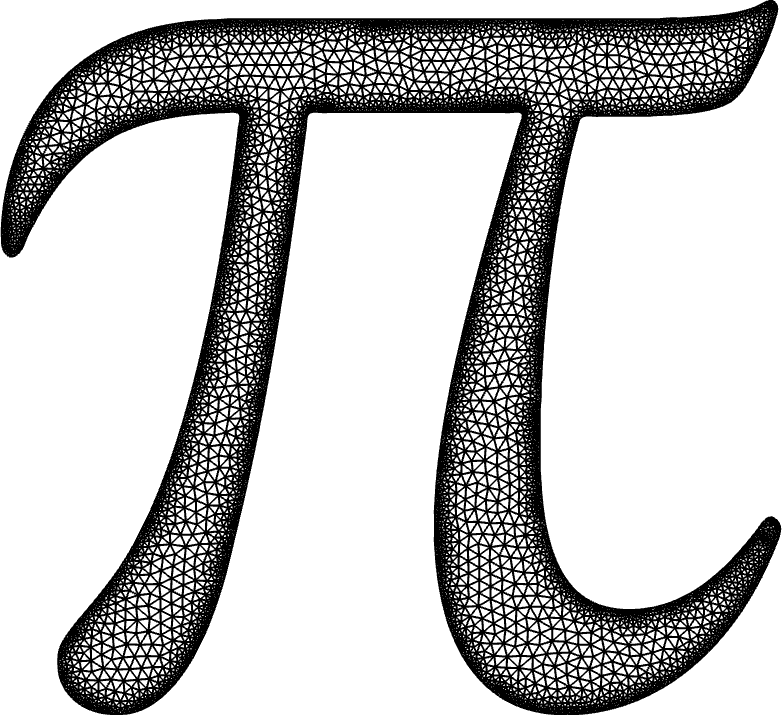
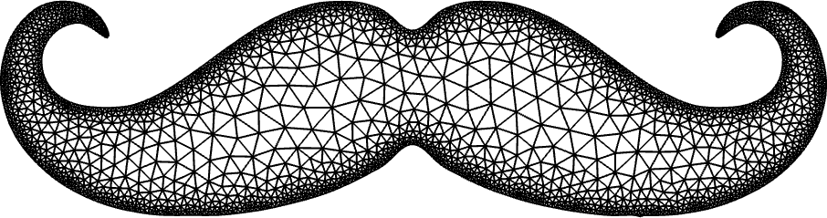

# 2dFemLib

This is a 2D finite element library entirely written in MATLAB for standard piecewise polynomial finite elements on a triangular mesh, developed while doing my PhD at the University of Basel.

It features
- a simple mesh generator 
- finite elements up to order 3
- mass lumping by including bubble functions
- a mix between object oriented and functional programming
- vectorized implementation of the finite element matricies
- including a small tutorial in the `Examples` folder

